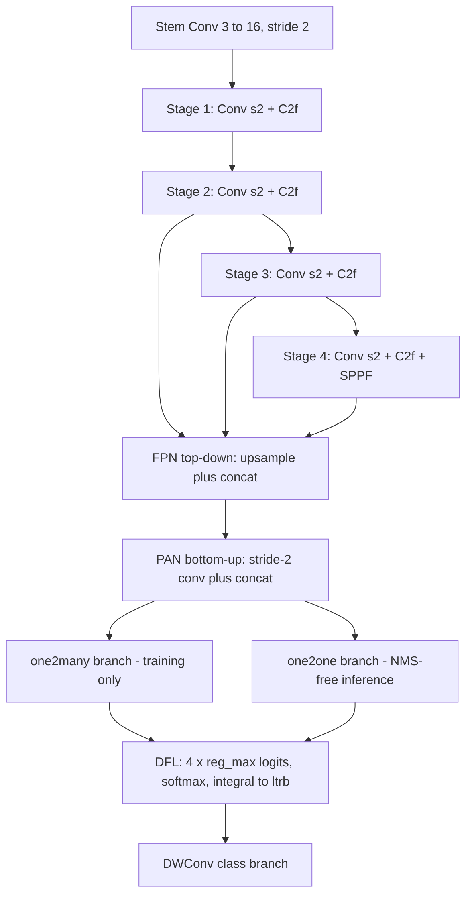

# 👁️ MiniYOLO-v2 — Real-Time Driver Fatigue Detector

> A from-scratch, edge-first object detector for driver-monitoring: **anchor-free, NMS-free, dual-head**, built and trained without Ultralytics. Detects `closed_eye`, `open_eye`, `yawning` and turns those detections into PERCLOS / blink / microsleep / yawn-rate telemetry over live video.

[](https://www.python.org/)
[](https://pytorch.org/)
[]()
[]()

<p align="center"><sub><b>Note:</b> the badges above are static (not CI-driven). Numbers are current as of the last commit to <code>main</code> — see <a href="./info/book.md"><code>info/book.md</code></a> for the full, dated experiment log with every number sourced.</sub></p>

---

## What this is

Two model generations live side by side:

- **`src/`** (v1) — the original CPU prototype. Frozen, its weights no longer exist on any machine this project has run on. Kept for the record, not for comparison.
- **`src/v2/`** (current) — a YOLO26/YOLOv10-style detector, built from scratch:
  - **Anchor-free**, no objectness branch
  - **NMS-free** one-to-one head at inference (dual one2many/one2one training, YOLOv10-style)
  - **Distribution Focal Loss** box regression (`reg_max=16`, added in Experiment 3)
  - **MuSGD** optimizer, **STAL** (small-target-aware label assignment), **ProgLoss** (progressive one2many→one2one blending)
  - **2.4M parameters**, ~5 MB exported (FP16 ONNX)
- **`src/v2/temporal.py`** — a separate, testable state machine that turns per-frame detections into PERCLOS, blink-vs-microsleep classification, and yawn-rate over a rolling window. See [§ Temporal driver monitoring](#temporal-driver-monitoring).

---

## Results so far

Three experiments, one variable changed at a time, all on the **same locked dataset** (`dataset/`, 18,447 images — see [§ Dataset](#dataset)). Full methodology, hypotheses and what each result did and didn't prove: [`info/book.md`](./info/book.md).

| Experiment | What changed | mAP50 | mAP50-95 | Precision | Recall | Status |
|---|---|:---:|:---:|:---:|:---:|:---|
| **1 — baseline** | first full run, mixed-convention data | 0.907 | 0.541 | 0.653 | 0.944 | ✅ done — [report](./checkpoints/Expi-1-imagez-384/) |
| **2 — clean labels** | dataset convention fixed (see below) | 0.900 | 0.483 | 0.664 | 0.940 | ✅ done — [report](./checkpoints/Expi-2-imagez-384/) |
| **3 — DFL head** | `reg_max` 1→16, adds distribution focal loss | — | — | — | — | 🔄 **training now** |

> Exp 1 and Exp 2 were scored on *different* test splits (see book.md §6.7 for why) — read the mAP50/mAP50-95 columns as within-experiment, not a strict apples-to-apples row comparison, without the caveat in the linked report.

**What Experiment 2 showed:** the original dataset mixed two annotation conventions under one class name — a tight per-eye box and a whole-face box, both labelled `closed_eye`/`open_eye`, 3–8× apart in scale. Filtering that out moved `open_eye` mAP50 +7.3 points but left `mAP50-95` essentially flat (0.541 → 0.483) — meaning the accuracy ceiling wasn't the labels. That pointed at the detection head.

**What Experiment 3 tests:** the head was regressing 4 raw scalars per box (`reg_max=1`, no DFL) — the weakest box representation available. `reg_max=16` with a proper distribution-focal loss term is now training. Two honest caveats about this run are documented in `book.md` §7.6 before results are in, including that it deliberately walks back a design choice YOLO26 itself made (DFL trades ~0.2 MB of export size and some quantization-friendliness for expected localization gains).

---

## Live snapshot — Experiment 3

```
epoch 20/300   mAP50 0.7213   mAP50-95 0.3838   P 0.4224   R 0.8514
80.3 s/epoch (69.8 train + 10.5 val)   elapsed 0.53 h
```

Early-run numbers, **not comparable to the finished exp 1 / exp 2 rows above** — mAP50-95 typically keeps climbing well past epoch 20. Re-check `checkpoints/Expi-3-imagez-384/REPORTS EXPI-3/training_log.csv` for the current line.

---

## Architecture



| stage | detail |
|---|---|
| Backbone | `MiniDarknetV2` — widths (16,32,64,128,256), depths (1,2,2,1), outputs P3/8, P4/16, P5/32 |
| Neck | `MiniPANv2` — FPN + PAN fusion |
| Head | Decoupled, anchor-free, DFL box regression (`reg_max=16`), no objectness, dual one2many/one2one |
| Loss | CIoU + L1 + DFL (box) · BCE with TAL soft targets (cls) · task-aligned + STAL assignment |
| Optimizer | MuSGD (`muon_ratio=0.5`), cosine LR, ProgLoss α: 0.8 → 0.1 |
| Size | 2.4M params · ~2.1 GFLOPs @384px · ~5.0 MB FP16 ONNX |

---

## Dataset

**`dataset/`** — one locked, validated dataset. 18,447 images / 28,864 boxes, hardlink-built and re-validated after every move (14 automated gates + 2 explicitly documented limitations, not silently assumed away).

| split | images | boxes | closed_eye | open_eye | yawning |
|---|---:|---:|---:|---:|---:|
| train | 14,442 | 22,632 | 10,435 | 5,418 | 6,779 |
| val | 2,101 | 3,223 | 1,551 | 663 | 1,009 |
| test | 1,904 | 3,009 | 1,391 | 716 | 902 |

- Provenance, the annotation-convention audit, the τ-threshold study behind the Experiment 2 filter, and every documented limitation (including that subject-disjointness *cannot* be established from the source metadata): **[`dataset/DATASET_REPORT.md`](./dataset/DATASET_REPORT.md)**.
- Re-validate any time: `python -m src.v2.tools.validate_dataset --data dataset --full-hash`

---

## Temporal driver monitoring

Detection is per-frame; fatigue is not. `src/v2/temporal.py` is a standalone state machine (27 passing tests, no video required to run them) that turns a stream of per-frame boxes into:

- **PERCLOS** — % eyelid closure over a rolling 60 s window
- **Blink vs. microsleep** — separated by duration (natural blink 100–400 ms; microsleep alarm fires the instant a closure crosses 1.5 s, not when it ends)
- **Yawn rate** — continuous-duration yawns per minute

Every threshold is a conventional literature default — **none is clinically validated against this dataset**, which has no drowsiness ground truth. Treat the output as instrumentation, not diagnosis (spelled out in the module docstring and every generated report).

Rendered live onto video by `src/v2/hud.py` — nav panel with PERCLOS/blink/yawn readout plus a full-width alarm strip on an active microsleep.

---

## Repository layout

```
mini_yolo/
├── dataset/                          the one locked, validated dataset (see above)
│   ├── data.yaml  DATASET_REPORT.md
│   └── metadata/                     manifests, class stats, test-set SHA-256 lock
├── checkpoints/                      every experiment, self-contained
│   └── Expi-<N>-imagez-<Size>/
│       ├── weights/                  best.pt, last.pt, best.onnx  (git-ignored, regenerable)
│       └── REPORTS EXPI-<N>/         evaluation.txt, training_log.csv, training_summary.txt,
│                                      args.yaml, hyp.yaml, plots/, demo_video/
├── info/
│   ├── book.md                       the full engineering record - every experiment,
│   │                                  every hypothesis, every number sourced, every
│   │                                  correction to earlier claims left visible, not edited away
│   └── study.md                      beginner-friendly architecture walkthrough
├── src/
│   ├── v2/                           current model (train / val / export / report / temporal / hud)
│   └── ...                           v1, frozen
├── AGENTS.md                         project rules for anyone (human or agent) working here
└── requirements.txt
```

Every training run is self-contained under `checkpoints/Expi-<N>-imagez-<Size>/` — see [`AGENTS.md`](./AGENTS.md) for the two standing rules this project enforces (directory layout, and mandatory logging to `book.md`). Model weights and rendered demo videos are not committed (regenerable, see `.gitignore`); every number and plot describing them is.

---

## Quickstart

```powershell
conda activate AI-3.11          # or any env with the requirements below
cd mini_yolo
pip install -r requirements.txt

# train
python -m src.v2.train --data dataset/data.yaml --scale n --imgsz 384 --batch 64 `
  --epochs 300 --workers 4 --seed 0 --reg-max 16 `
  --project checkpoints --name Expi-N-imagez-384 --exist-ok

# full report: evaluation + 10 plots + annotated demo video with fatigue HUD
python -m src.v2.report --weights "checkpoints/Expi-N-imagez-384/weights/best.pt" `
  --data dataset/data.yaml --video "dataset/VIDEO FOR TEST/15-MaleGlasses.mp4" `
  --out "checkpoints/Expi-N-imagez-384/REPORTS EXPI-N"

# export to NMS-free FP16 ONNX for edge deployment
python -m src.v2.export --weights "checkpoints/Expi-N-imagez-384/weights/best.pt" `
  --imgsz 384 --half --device cuda:0 --name best
```

Replace `Expi-N-imagez-384` with the real experiment folder name (e.g. `Expi-3-imagez-384`).
Requires: Python 3.11, PyTorch 2.6.0+cu124 (CUDA recommended, CPU works). Full dependency list in `requirements.txt`.

---

## Documentation index

| Doc | What's in it |
|---|---|
| [`info/book.md`](./info/book.md) | The engineering record — every experiment, dated, with corrections to earlier claims kept visible rather than edited away |
| [`AGENTS.md`](./AGENTS.md) | Project rules: directory layout, mandatory result logging, known bugs fixed, things not to do |
| [`dataset/DATASET_REPORT.md`](./dataset/DATASET_REPORT.md) | Dataset provenance, cleaning methodology, quality audit, documented limitations |
| [`info/study.md`](./info/study.md) | Beginner-friendly walkthrough of the architecture |

---

## Classes

| ID | Class | Meaning |
|:---:|---|---|
| 0 | `closed_eye` | fatigue / drowsiness / micro-sleep signal |
| 1 | `open_eye` | alert, wakeful |
| 2 | `yawning` | early fatigue signal |
