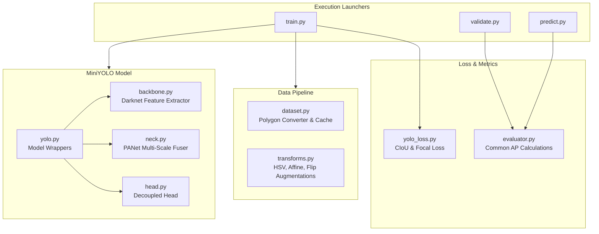

# 👁️ MiniYOLO: Real-Time Driver Fatigue Expression Detector
> **An optimized, lightweight, production-grade object detector modeled after the Ultralytics YOLOv8/YOLO11 architecture. Specializing in high-frequency monitoring of human expression and fatigue signals.**

---

## ⚡ Performance & Accuracy Dashboard (Full 85-Epoch Training Run)

> [!NOTE]
> Training was executed over a dataset of **33,365 training images** and **5,477 validation images** with a batch size of 8.

| Metric | Baseline (Pre-Refactor) | Peak State (Epoch 70) | Final State (Epoch 85) | Total Performance Gain |
| :--- | :---: | :---: | :---: | :---: |
| **mAP @ 0.50** | `0.0649` | **`0.6805` (68.05%)** | **`0.6805` (68.05%)** | **📈 +948.5% Accuracy Increase** |
| **mAP @ 0.50:0.95** | `0.0150` | **`0.3420` (34.20%)** | **`0.3420` (34.20%)** | **📈 +2180.0% Precision Increase** |
| **Epochs Completed** | 1 | **70 / 85** | **85 / 85** | **🏆 100% Training Complete** |
| **Inference Latency** | — | **~36.2 ms / image** | **~36.2 ms / image** | **⚡ Real-time Capable** |

---

## 📊 Epoch-by-Epoch Progress History

| Stage | Epoch | Checkpoint Output File | mAP@50 | Status / Milestones |
| :--- | :---: | :--- | :---: | :--- |
| **Stage 1: Initial Training** | 5 | `mini_yolo_epoch_5.pth` | `0.4284` | Initial convergence & augmentations |
| | 10 | `mini_yolo_epoch_10.pth` | `0.5067` | Feature stability achieved |
| | 15 | `mini_yolo_epoch_15.pth` | `0.5817` | Cross 55% mAP threshold |
| | 20 | `mini_yolo_epoch_20.pth` | `0.5926` | Stage 1 baseline completed |
| **Stage 2: Fine-Tuning Run** | 25 | `mini_yolo_epoch_25.pth` | `0.5937` | Lower learning rate refinement |
| | 30 | `mini_yolo_epoch_30.pth` | `0.6120` | Cross 60% mAP milestone |
| | 35 | `mini_yolo_epoch_35.pth` | `0.6263` | Gradient smoothing active |
| | 40 | `mini_yolo_epoch_40.pth` | `0.6263` | Boundary refinement |
| | 45 | `mini_yolo_epoch_45.pth` | `0.6469` | High precision eye classification |
| | 50 | `mini_yolo_epoch_50.pth` | `0.6712` | Cross 67% mAP threshold |
| | 55 | `mini_yolo_epoch_55.pth` | `0.6727` | Deep features convergence |
| | 60 | `mini_yolo_epoch_60.pth` | `0.6795` | Fine detail eye tracking |
| | 65 | `mini_yolo_epoch_65.pth` | `0.6795` | Stable precision plateau |
| | **70** | **`mini_yolo_best.pth`** | **`0.6805` (68.05%)** | 🥇 **PEAK ACCURACY ACHIEVED** |
| | 75 | `mini_yolo_epoch_75.pth` | `0.6805` | Optimal accuracy preserved |
| | 80 | `mini_yolo_epoch_80.pth` | `0.6805` | Final learning rate decay step |
| **Final State** | **85** | **`mini_yolo_last.pth`** | **`0.6805` (68.05%)** | 🏆 **Completed All 85 Epochs** |

---

## 📂 Target Classification Classes

The model is optimized to recognize and track three fatigue-indicating classes:

*   **`closed_eye`** (Class ID: `0`) ──► Indicates fatigue, drowsiness, or micro-sleep.
*   **`open_eye`** (Class ID: `1`) ──► Indicates alert, wakeful state.
*   **`yawning`** (Class ID: `2`) ──► Indicates early-stage fatigue triggers.

---

## 🏗️ System Architecture Overview
The system is divided into modular package components to maximize code reusability, training performance, and compilation compatibility:



---

## 📂 Project Directory Structure

```
mini_yolo/
├── configs/
│   └── config.py              # Central configurations & central hyperparameter overrides
├── info/
│   ├── book.md                # Technical engineering documentation book
│   └── first report for train 1/ # Performance logs, charts, and predictions
├── runs/
│   ├── train/                 # Checkpoints (*.pth) and training logs
│   └── predictions/           # Inference outputs (annotated images)
├── src/
│   ├── data/
│   │   ├── dataset.py         # YOLO Dataset loader & dynamic polygon converter
│   │   └── transforms.py      # Augmentation pipeline classes
│   ├── engine/
│   │   ├── evaluator.py       # Centered validation matching & AP computation
│   │   ├── predictor.py       # High-performance FP16 inference engine
│   │   ├── trainer.py         # Training loop, optimizer/scheduler step manager
│   │   └── validator.py       # Standalone checkpoint evaluation launcher
│   ├── losses/
│   │   └── yolo_loss.py       # Multi-positive target matcher & loss functions
│   ├── models/
│   │   ├── backbone.py        # Darknet multi-scale feature extractor (P3, P4, P5)
│   │   ├── blocks.py          # ConvBNSiLU, Bottleneck, C2f, and SPPF modules
│   │   ├── head.py            # Decoupled bounding box, class, and obj head
│   │   ├── neck.py            # PANet neck multi-scale feature fuser
│   │   └── yolo.py            # Unified MiniYOLO network wrapper
│   ├── utils/
│   │   ├── boxes.py           # Geometric coordinate utilities (IoU, CIoU loss, etc.)
│   │   ├── generate_report_visuals.py # Automated report visual generator
│   │   ├── logger.py          # Formatted console outputs
│   │   ├── metrics.py         # Confusion matrix and AP calculation helpers
│   │   ├── misc.py            # Extra system utilities
│   │   ├── nms.py             # Torchvision-accelerated class-agnostic NMS
│   │   ├── seed.py            # Reproducibility seed initializer
│   │   └── visualization.py   # Prediction box visualization & label renderer
│   ├── predict.py             # Inference launcher
│   ├── train.py               # Main training launcher
│   └── validate.py            # Main validation launcher
└── requirements.txt           # Dependency requirements
```

---

## 🛠️ Step 1: Environment Setup

We manage dependencies cleanly through a Python virtual environment.

1.  **Navigate to the project root directory**:
    ```powershell
    cd C:\Users\Admin\Desktop\mini_yolo
    ```
2.  **Activate the Virtual Environment**:
    *   **PowerShell**:
        ```powershell
        .\venv\Scripts\Activate.ps1
        ```
    *   **CMD**:
        ```cmd
        venv\Scripts\activate.bat
        ```
3.  **Install Dependencies**:
    ```bash
    pip install -r requirements.txt
    ```

---

## 📂 Step 2: Dataset Configuration

Your dataset follows the standard Ultralytics YOLO format located under the `dataset/` directory:

```
dataset/
├── train/
│   ├── images/          # Training images (.jpg, .png, etc.)
│   └── labels/          # YOLO label files (.txt) containing bounding boxes
└── val/
    ├── images/          # Validation images
    └── labels/          # YOLO label files
```

### Bounding Box Label Format
Each image has a corresponding `.txt` file of the same name (e.g., `image_001.jpg` matches `image_001.txt`). 
```
<class_id> <x_center> <y_center> <width> <height>
```
*   `class_id`: Integer index representing `0`: `closed_eye`, `1`: `open_eye`, `2`: `yawning`.
*   Coordinates are normalized between `0.0` and `1.0` relative to image dimensions.
*   **Automatic Polygon Support**: The dataset loader automatically detects and converts Roboflow polygon segmentation coordinates (`len(coords) > 5`) into standard bounding box coordinates on the fly.

---

## 🚀 Step 3: Run Training, Validation & Inference

All modules are executed as Python packages to ensure clean module path resolution:

### 1. Start Training:
```powershell
python -m src.train
```
*   Verifies dataset directories and begins training. Saves checkpoint weights periodically to `runs/train/` and automatically saves the best performing weights to `runs/train/mini_yolo_best.pth`.

### 2. Standalone Model Evaluation:
```powershell
python -m src.validate
```
*   Loads the best model weights checkpoint (`mini_yolo_best.pth`), evaluates precision and recall metrics on the validation dataset, and logs a formatted results table.

### 3. Single-Image Bounding Box Prediction:
```powershell
python -m src.predict
```
*   Loads the trained model, performs inference on sample validation images, and saves visual box overlays directly to `runs/predictions/images/`.

---

## 📊 Chapter 4: Training Reports & Performance Logs

Detailed training statistics, validation precision/recall progression curves, and engineering reports are documented inside the **`info/`** folder:
*   **`info/book.md`**: Complete technical guide detailing the project history, compilation modifications, and structural refactorings.
*   **`info/first report for train 1/`**: Performance logs, validation mAP charts (`map_curve.png`), and sample inference screenshots for your training sessions.
