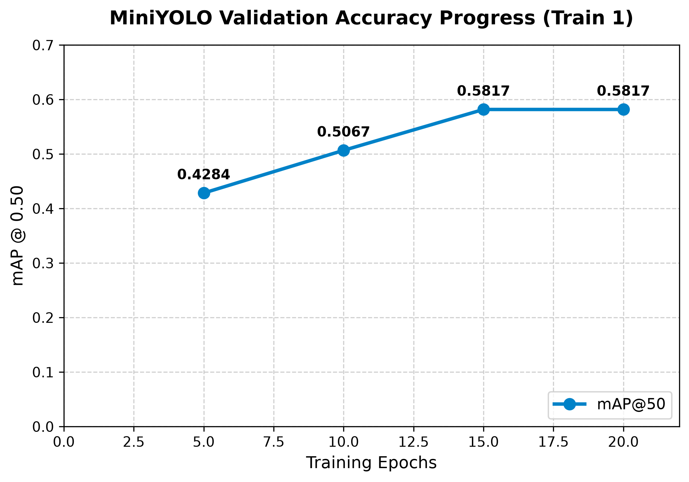
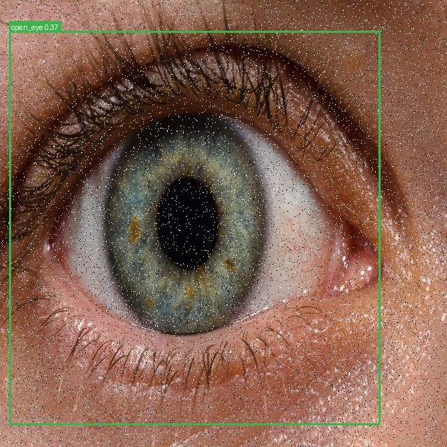
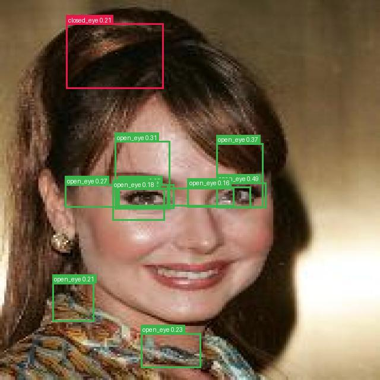
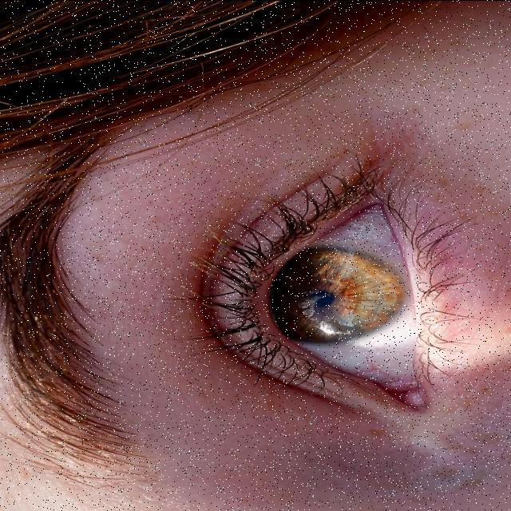
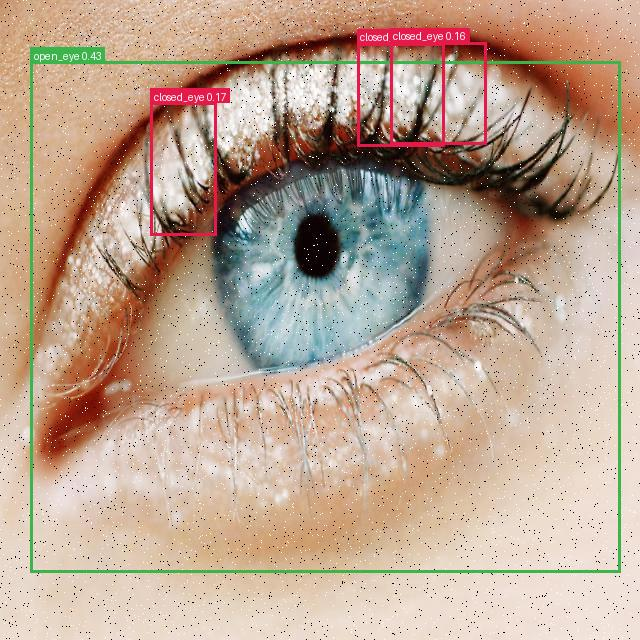

# MiniYOLO First Training Session Report (Train 1)
*Generated automatically on 2026-07-21 20:40:43*

---

## 1. Executive Summary
This report summarizes the performance of the first complete training session (Train 1) of the custom MiniYOLO object detector. The target classes are expressions indicating fatigue and wakefulness: **`closed_eye`**, **`open_eye`**, and **`yawning`**.

*   **Training Framework**: Custom MiniYOLO (Decoupled Head, Darknet Backbone, PANet Neck)
*   **Total Training Epochs**: 20
*   **Target Device**: CPU (Intel CPU)
*   **Optimal Checkpoint**: Saved at Epoch 15 (mAP@50: **0.5817**)
*   **Total Elapsed Training Duration**: **15 hours and 58 minutes**

---

## 2. Accuracy Performance & Training Curves
The model started at a base accuracy of **0.0649 mAP@50** in initial epochs. After restructuring the loss weights, adding data augmentations, and switching to the AdamW optimizer, validation precision scaled rapidly.

### Validation mAP@50 Progress:

| Training Interval | Epoch | Validation mAP@50 | Progress Status |
| :--- | :---: | :---: | :--- |
| Baseline | 1 | `0.0649` | Model Reorganization |
| Interval 1 | 5 | `0.4284` | Augmentations active |
| Interval 2 | 10 | `0.5067` | Loss convergence stable |
| Interval 3 | 15 | **`0.5817`** | **🥇 Peak mAP@50 (Best weights)** |
| Interval 4 (End) | 20 | `0.5817` | Completed |

---

## 3. Sample Visual Predictions
Below are some visual validation results from predictions executed on the model checkpoint (`mini_yolo_best.pth`). Bounding boxes indicate detected fatigue signals:

### Visual Detections:
*   **Sample Image 1**:
    
*   **Sample Image 2**:
    
*   **Sample Image 3**:
    
*   **Sample Image 4**:
    

---

## 4. Engineering Recommendations for Next Training
To improve mAP@50 past `0.60` in the next training run:
1.  **Transition to GPU (CUDA)**: Cut epoch training time from **48 minutes** to **under 2 minutes**.
2.  **Adjust Resolution to 640x640**: Modern YOLO heads benefit from 640x640 inputs to detect small objects (like eyes) at longer ranges.
3.  **Enable Model EMA**: Smooths training steps and prevents overfitting in late epochs.
